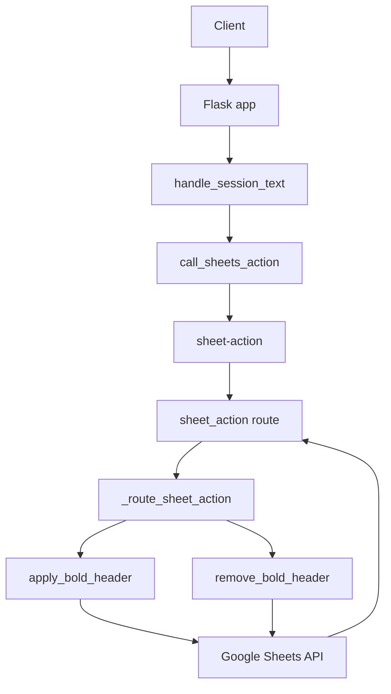
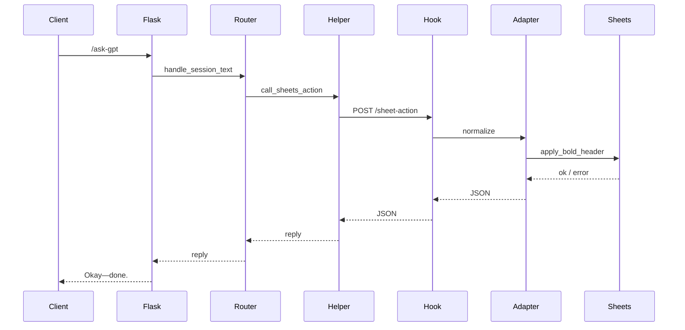

```mermaid
flowchart TD
  A[Client]
  B[Flask app]
  C[handle_session_text]
  D[call_sheets_action]
  E[sheet-action]
  F[sheet_action route]
  H[_route_sheet_action]
  I[apply_bold_header]
  J[remove_bold_header]
  K[Google Sheets API]

  A --> B
  B --> C
  C --> D
  D --> E
  E --> F
  F --> H
  H --> I
  H --> J
  I --> K
  J --> K
  K --> F
```

```mermaid
sequenceDiagram
  participant Client
  participant Flask
  participant Router
  participant Helper
  participant Hook
  participant Adapter
  participant Sheets

  Client->>Flask: /ask-gpt
  Flask->>Router: handle_session_text
  Router->>Helper: call_sheets_action
  Helper->>Hook: POST /sheet-action
  Hook->>Adapter: normalize
  Adapter->>Sheets: apply_bold_header
  Sheets-->>Adapter: ok / error
  Adapter-->>Hook: JSON
  Hook-->>Helper: JSON
  Helper-->>Router: reply
  Router-->>Flask: reply
  Flask-->>Client: Okay—done.
```
